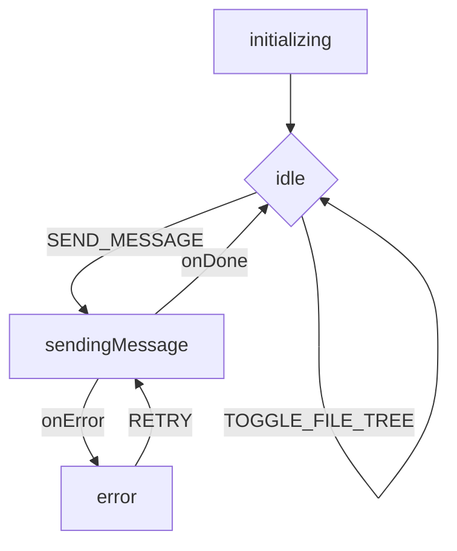

# Architecture

This document outlines the architecture of the AI-Powered Code Editor.

## Core Components

*   **Frontend**: A single-page application built with HTML, CSS, and JavaScript. It uses the Monaco Editor for the text editor and communicates with the backend via a REST API.
*   **Backend**: A Node.js server using Express. It handles requests from the frontend, communicates with the Google Gemini API, and can execute terminal commands.
*   **AI Agent**: The agent logic is integrated into the frontend, using the Gemini API for tool-calling and chat functionality.

## State Management with XState

The application's state management has been refactored to use **XState**, a powerful library for creating and managing state machines. This provides a robust, centralized, and predictable way to handle application logic, replacing the previous imperative approach.

*   **Centralized State Machine**: All primary application state is managed by a single XState machine defined in `frontend/app-state.js`. This includes the AI chat's status (idle, sending, error), tool-calling logic, and even UI state like panel visibility.
*   **Declarative Logic**: Instead of using boolean flags (`isSending`), the application now transitions between clearly defined states (e.g., `idle`, `sendingMessage`). This makes the application flow easier to understand, debug, and extend.
*   **Visual Debugging**: The integration of `@xstate/dev-tools` allows for real-time visualization of the state machine, providing unparalleled insight into the application's behavior.

### State Machine Diagram

This diagram illustrates the flow of the main application state machine.

